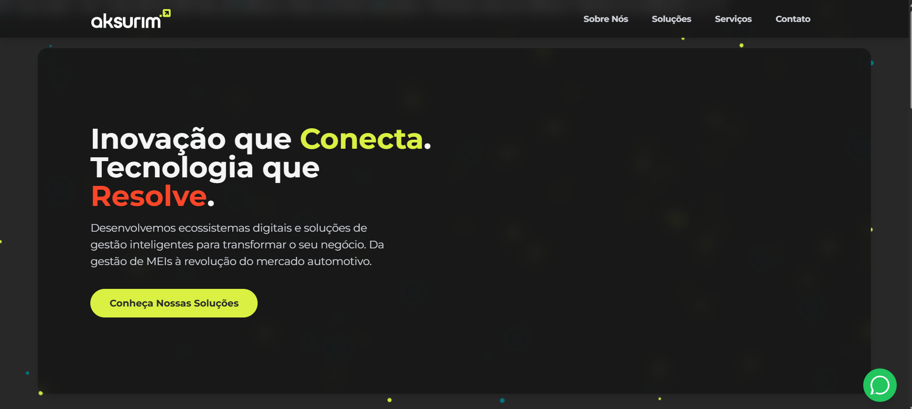

# Site Institucional - Aksurim Software


Este repositório contém o código-fonte do site institucional da **Aksurim Software**, uma empresa de tecnologia focada em inovação e soluções de gestão inteligentes. O projeto foi desenvolvido para ser uma presença digital robusta, moderna e de alta performance.

> 🔗 **Acesse a versão ao vivo:** [https://www.aksurim.com/](https://www.aksurim.com/)

---

## 📸 Captura de Tela


*(Sugestão: tire um print da tela principal e salve como `screenshot.png` na raiz do projeto para que esta imagem apareça aqui.)*

---

## ✨ Features Principais

- **Background Interativo:** Animação de partículas em Vanilla JavaScript que se movem de forma fluida, sem o uso de bibliotecas externas pesadas.
- **Design Moderno com Glassmorphism:** Seções com fundo translúcido e efeito de desfoque para garantir legibilidade e uma estética de alta tecnologia.
- **Navegação Flutuante e Suave:** Um menu fixo no topo da página com links que levam o usuário às seções com uma animação de rolagem suave (`scroll-behavior: smooth`).
- **Totalmente Responsivo:** O layout se adapta perfeitamente a dispositivos móveis, tablets e desktops. A animação de partículas é otimizada para telas menores, garantindo a performance.
- **Otimizado para SEO:** Implementação das melhores práticas de SEO on-page, incluindo meta tags, títulos semânticos e atributos `alt` para imagens, alcançando nota máxima nos testes do Lighthouse.
- **Alta Performance:** Construído com foco na leveza e velocidade de carregamento, evitando bibliotecas desnecessárias e alcançando excelentes notas no Google Lighthouse.
- **Contato Rápido:** Botão flutuante de WhatsApp para facilitar o contato direto.

---

## 🛠️ Tecnologias Utilizadas

- **HTML5:** Estrutura semântica e moderna.
- **Tailwind CSS (via CDN):** Prototipagem rápida e estilização utilitária para um design consistente e responsivo. As cores da marca foram configuradas diretamente no script do CDN.
- **JavaScript (Vanilla JS):** Utilizado para a lógica da animação de partículas no background e para a animação de entrada dos elementos.
- **Google Fonts:** Fonte "Montserrat" para garantir a consistência com a identidade visual da marca.

---

## 🚀 Como Executar o Projeto

Existem duas maneiras de executar este projeto localmente:

**1. Maneira Simples (Sem Servidor)**

Como o projeto é construído com tecnologias web padrão e não requer um processo de build, você pode simplesmente:
   - Abrir o arquivo `index.html` diretamente no seu navegador de preferência.

**2. Maneira Recomendada (Com Servidor Local)**

Para uma experiência mais próxima de um ambiente de produção e para evitar possíveis problemas com requisições de arquivos locais, recomenda-se o uso de um servidor local. Se você utiliza o **Visual Studio Code**, a extensão **Live Server** é uma ótima opção:

   1. **Clone o repositório:**
      ```sh
      git clone https://github.com/aksurim/aksurim-website.git
      ```
   2. **Abra a pasta no VS Code.**
   3. **Instale a extensão [Live Server](https://marketplace.visualstudio.com/items?itemName=ritwickdey.LiveServer).**
   4. **Clique com o botão direito no arquivo `index.html` e selecione "Open with Live Server".**

Isso iniciará um servidor local e abrirá o site automaticamente no seu navegador.

---

## 📂 Estrutura do Projeto

```
aksurim-website/
│
├── assets/
│   └── logo.png         # Logo da empresa
│
├── index.html           # Arquivo principal com toda a estrutura e conteúdo
├── script.js            # Lógica da animação de partículas em Vanilla JS
└── README.md            # Este arquivo
```

---

## ⚖️ Licença

Este projeto está sob a licença MIT. Veja o arquivo `LICENSE` para mais detalhes.

---

## 👨‍💻 Autor

Desenvolvido com dedicação por **Joannderson Lucena**.

> **Sys Aksurim (SA)**
>
> Copyright (c) 2024 Aksurim Software. Todos os direitos reservados.
>
> **Produtora:** Aksurim Software
>
> **Website:** [https://www.aksurim.com/](https://www.aksurim.com/)

---

**Conecte-se comigo:**

- **Portfólio:** [https://portfolio.aksurim.com/](https://portfolio.aksurim.com/)
- **LinkedIn:** [https://www.linkedin.com/in/joanndersonlucena/](https://www.linkedin.com/in/joanndersonlucena/)
- **GitHub:** [https://github.com/aksurim](https://github.com/aksurim)
```